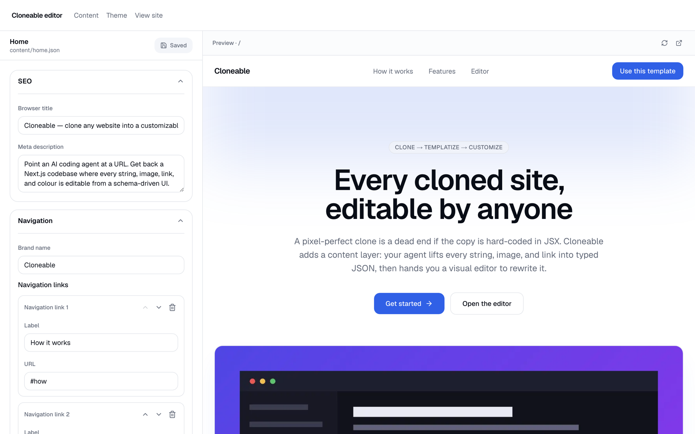
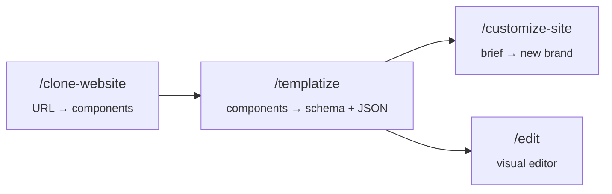
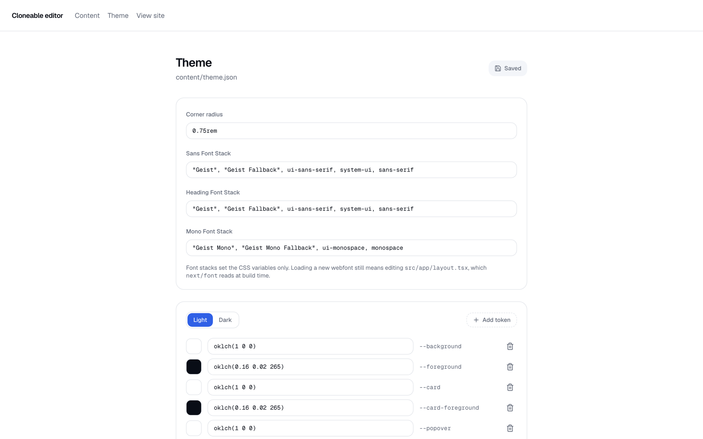

<div align="center">

<h1>Cloneable</h1>

<h3>Clone any website — then make every word of it editable</h3>

<p>
Point an AI coding agent at a URL. Get back a Next.js codebase where the layout is a
pixel-perfect clone and the content is <strong>typed, validated JSON</strong> that anyone can
edit in a visual editor.
</p>

<p>
<a href="https://cloneable-seven.vercel.app"><strong>Live demo</strong></a> ·
<a href="#quick-start">Quick start</a> ·
<a href="#how-it-works">How it works</a> ·
<a href="#the-content-layer">Content layer</a> ·
<a href="#the-editor">Editor</a> ·
<a href="#faq">FAQ</a>
</p>

<p>
<a href="https://github.com/vishalmeena2211/cloneable/actions/workflows/ci.yml"></a>
<a href="https://github.com/vishalmeena2211/cloneable/stargazers"></a>
<a href="LICENSE"></a>


</p>



</div>

---

## The problem

Cloning a website is close to solved. Give a capable agent browser access and it will reproduce
a page almost exactly.

What you get back is the problem:

```tsx
<h1 className="text-5xl font-semibold tracking-tight">Ship faster with Acme</h1>
```

The copy is welded to the markup. Every text change is now a code change — so you can't hand it
to a client, can't reuse the layout for a second brand, and can't let anyone who isn't a
developer near it. The clone is a photograph when what you wanted was a mould.

## The fix

`/templatize` runs after the clone and separates the two halves of the page. **Structure** —
layout, spacing, computed CSS, interaction behaviour — stays in the component. **Content** —
words, images, links, repeat counts — moves out into typed JSON.

<table>
<tr><th>Before</th><th>After</th></tr>
<tr><td>

```tsx
<h1 className="text-5xl font-semibold">
  Ship faster with Acme
</h1>
```

</td><td>

```tsx
<h1 className="text-5xl font-semibold">
  {content.hero.title}
</h1>
```

</td></tr>
</table>

Not one class name changed — the rendered pixels are identical. But the string now lives here:

```jsonc
// content/home.json
{ "hero": { "title": "Ship faster with Acme" } }
```

described by this:

```ts
// src/content/pages/home.ts
hero: z.object({ title: text("Headline") })
```

and that schema is the *only* thing you write. It gives you validation on every load, a
TypeScript type for the component prop, **and** a form control in the editor — no form code, no
second source of truth.

## Quick start

```bash
npm install
npm run dev
```

Open [localhost:3000](http://localhost:3000) for the demo page and
[localhost:3000/edit](http://localhost:3000/edit) to edit it. The demo page is itself
content-driven, so the editor works before you've cloned anything.

To clone a real site, start an agent with browser access:

```bash
claude --chrome
```

then run the three skills in order:

```
/clone-website https://example.com
/templatize
/customize-site "a dental clinic in Bhopal, warm and reassuring, teal palette"
```

**Prerequisites:** Node.js 24+, and an agent with browser automation (Chrome MCP, Playwright MCP,
or similar) for the cloning step. Templatizing and customizing need no browser.

## Deploy

[](https://vercel.com/new/clone?repository-url=https%3A%2F%2Fgithub.com%2Fvishalmeena2211%2Fcloneable)

Zero configuration — it's a standard Next.js app. A live deployment of this repo runs at
**[cloneable-seven.vercel.app](https://cloneable-seven.vercel.app)**. Vercel's default Node 24 matches the
`engines` requirement, and `output: "standalone"` is skipped automatically on Vercel (it exists
for the Dockerfile).

Two things worth understanding about the deployed site:

- **Content is baked in at build time.** Pages read their JSON during the build and prerender as
  static, so editing content means committing the JSON and redeploying. That's the trade for
  getting a fully static site with no database.
- **`/edit` is disabled in production** and shows an "Editor unavailable" notice. This is
  deliberate — the editor writes files into the repo, which a deployed instance can't do and
  shouldn't be able to. Edit locally with `npm run dev`, commit, push. See the
  [FAQ](#faq) if you want clients editing a live site.

Self-hosting with Docker works too — `docker compose up app --build`.

## How it works



| Skill | What it does |
| --- | --- |
| **`/clone-website <url>`** | Browser-driven reverse engineering. Screenshots, an interaction sweep, exact `getComputedStyle()` extraction, a spec file per section, then parallel builder agents in git worktrees. |
| **`/templatize [page]`** | Lifts every string, image, link, and repeated block into a zod schema plus a JSON file, rewires the components, registers the page, generates the placeholder variant. |
| **`/customize-site <brief>`** | Rewrites content and theme for a new brand. Hard invariant: **never edits a component.** If the brief needs one, it reports instead of quietly reaching in. |

Templatizing is a **refactor, not a redesign** — the skill screenshots the page before and after
at 1440px and 390px and treats any visual difference as a bug it introduced.

## The content layer

Content is validated on load, so a mismatch between schema and JSON fails the build with exact
field paths instead of silently rendering an empty page:

```
content/home.json does not match the "home" schema:
  · hero.subtitle — Invalid input: expected string, received undefined
  · features.items.0.icon — Invalid option: expected one of "sparkles"|"gauge"|"layers"…
```

The rules that keep it useful rather than becoming a second stylesheet:

- **Repeats are arrays, never `card1`/`card2`.** Arrays get add/remove/reorder in the editor,
  which is what makes a template actually reusable. Components must render at length zero,
  because someone will delete an item.
- **Variants are enums,** so the editor offers a dropdown and a typo can't reach the page.
- **No `z.any()`, no free-form record.** If the editor can't render a control for it, it isn't
  content.
- **Props are derived, never re-declared** — `Content["hero"]`, so the type can't drift.
- **CSS never becomes content.** A `padding` field in JSON is how a template turns into a worse
  stylesheet.

## The editor

`/edit` generates its form from the schema via JSON Schema. Add a field to a zod schema and a
control appears for it — arrays get add/remove/reorder, enums get dropdowns, `ui` hints pick
the widget. Form on the left, live preview on the right, <kbd>⌘</kbd><kbd>S</kbd> to save.

Writes go through the same validation as loads, so the editor **cannot** produce a page that
fails to build.

> [!IMPORTANT]
> The editor is **development-only**. It writes files in your repo, so it's disabled in
> production builds — a hosted, unauthenticated content-write endpoint is a defacement vector.
> See the [FAQ](#faq) for what to do if you want clients editing a live site.

### Theme



`content/theme.json` holds the colour tokens, radius, and font stacks, and overrides the
shadcn variables at runtime. The generated CSS uses `html:root` rather than `:root`, so it wins
on specificity regardless of stylesheet order — no `!important`, no cascade roulette.

## The placeholder variant

`/templatize` also emits `content/<page>.placeholder.json`, where the source site's copy and
imagery are replaced with neutral stand-ins — while **enum values, numbers, internal routes, and
array lengths are preserved**, so the layout is unchanged and the schema still validates.

| | `original` | `placeholder` |
| --- | --- | --- |
| Headlines, body copy | from the source | neutral copy |
| Images | from the source | `/images/placeholder.png` |
| Internal routes (`/pricing`, `#faq`) | kept | kept |
| External URLs | kept | `#` |
| Enum values, array lengths | kept | kept |

Flip `content/config.json` to `{"variant": "placeholder"}` and you're serving the structure
without the source's words and pictures. It's schema-aware rather than a find-and-replace, which
is why `icon: "layers"` survives instead of being turned into prose that fails validation.

## Supported agents

Skills are generated for **Claude Code** (recommended), Codex CLI, Cursor, Windsurf, GitHub
Copilot, Gemini CLI, OpenCode, Cline, Roo Code, Continue, Kiro, Amazon Q, and Augment Code.

One source of truth per skill, synced to all thirteen:

```bash
node scripts/sync-skills.mjs      # .claude/skills/*/SKILL.md  → 13 platforms
bash scripts/sync-agent-rules.sh  # AGENTS.md                  → per-agent rule files
```

CI fails if the generated files drift from their sources, so the copies can't silently rot.

<details>
<summary><strong>Project structure</strong></summary>

```
content/
  config.json                 # Which variant is served: original | placeholder
  theme.json                  # Colour tokens, radius, font stacks
  home.json                   # Page content
  home.placeholder.json       # Generated: source copy + imagery stripped
src/
  content/
    primitives.ts             # text/longText/url/image/link/seo field helpers
    pages/home.ts             # One zod schema per page
    registry.ts               # The only list of pages
  lib/
    content/                  # Loader, validation, placeholder generator
    theme/                    # Theme schema + CSS variable rendering
  components/
    sections/                 # Page sections — take content as props
    editor/                   # Schema-driven form, theme editor
  app/
    edit/                     # Dev-only visual editor
    api/                      # Dev-only content + theme write endpoints
.claude/skills/               # Source of truth for all three skills
docs/research/                # Clone inspection output, component specs
```

</details>

<details>
<summary><strong>Commands</strong></summary>

```bash
npm run dev        # Dev server + editor
npm run build      # Production build
npm run lint       # ESLint
npm run typecheck  # tsc --noEmit
npm run check      # lint + typecheck + build
```

</details>

## FAQ

<details>
<summary><strong>Why not just use a headless CMS?</strong></summary>

You still have to model the content by hand for every site you clone, then wire each field up
one at a time. Here the schema is written *from* the clone as part of templatizing, and the
editor renders itself from that schema.

If you outgrow JSON, `src/lib/content/store.ts` is the single seam — swap the loader for a CMS
or database client and everything above it keeps working.

</details>

<details>
<summary><strong>Can I deploy the editor so clients can edit the live site?</strong></summary>

Not as-is, deliberately. The editor writes files into your repository, which a deployed instance
has no business doing and no writable filesystem for.

For a hosted setup you need two things: authentication, and a content store that isn't the
filesystem. Replace the loader in `src/lib/content/store.ts` with a database or CMS client and
put auth in front of the `/api/content` routes. The schemas, the form, and the components all
stay exactly as they are.

</details>

<details>
<summary><strong>Does it work on JavaScript-heavy sites?</strong></summary>

Yes — extraction runs against the live DOM through a real browser, reading `getComputedStyle()`
on rendered elements, so a client-rendered page is no harder than a static one. The interaction
sweep exists precisely to capture behaviour a static scrape would miss: scroll-driven states,
hover transitions, tab content, and smooth-scroll libraries.

What it can't recover is server-side logic, real data, or anything behind auth.

</details>

<details>
<summary><strong>Do I have to use Claude Code?</strong></summary>

No — the same skills are generated for thirteen agents. Claude Code is recommended because the
clone pipeline leans on parallel subagents in git worktrees, which not every agent does well.

The cloning step needs browser automation. Templatizing and customizing don't, so any agent can
do those.

</details>

<details>
<summary><strong>What about multi-page sites?</strong></summary>

`/clone-website` accepts multiple URLs and namespaces each one's research, screenshots,
components, and assets by a hash of its origin and pathname, preserving the source pathname as
the route. Templatize them one at a time — they all write to `src/content/registry.ts`, so
parallel runs in one worktree will conflict.

</details>

## Roadmap

- [ ] Hosted editor: auth + a database-backed content store behind the same schemas
- [ ] CMS adapters for the loader seam (Sanity, Payload)
- [ ] Whole-site crawl with shared-layout detection
- [ ] Block library extraction — clone *n* sites into a reusable section library

## Use responsibly

This tool reproduces websites. That's legitimate for sites you own, sites you've been engaged to
rebuild, and learning. It is not a licence to copy someone else's business.

- **Don't** use it for phishing, impersonation, or passing off another company's design as your own
- **Don't** redistribute the source's copy, photography, logos, or brand marks — that's what the
  placeholder variant is for
- **Do** check the target's terms of service before cloning

Layout and structure are far weaker ground for a copyright claim than copy and imagery, so
stripping the content isn't only courteous — it's the practical difference between a template
and a copy.

## Contributing

Issues and pull requests welcome. Please run `npm run check` before opening a PR, and if you
touch `AGENTS.md` or any `.claude/skills/*/SKILL.md`, run the sync scripts and commit the
generated output — CI verifies they're in sync.

## License

[MIT](LICENSE)
