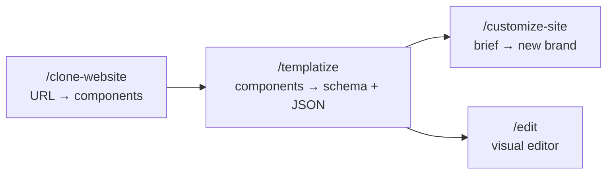

<div align="center">

# Reforge

### Clone any website — then make every word of it editable

Point an AI coding agent at a URL. Get back a Next.js codebase where the layout is a
pixel-perfect clone and the **content is typed, validated JSON** you can edit in a visual editor.

<sub>MIT licensed · Built on [ai-website-cloner-template](https://github.com/JCodesMore/ai-website-cloner-template)</sub>

</div>

---

## Why this exists

Cloning a site is a solved problem — a good agent with browser access can reproduce a page
almost exactly. The trouble starts afterwards.

A finished clone has its copy hard-coded in JSX:

```tsx
<h1 className="text-5xl font-semibold tracking-tight">Ship faster with Acme</h1>
```

Every text change is now a code change. You cannot hand that to a client, you cannot reuse the
layout for a second brand, and you cannot let anyone who is not a developer touch it.

Reforge adds the missing step. After the clone passes visual QA, `/templatize` lifts every
string, image, link, and repeated block into a zod schema plus a JSON file, and rewires the
components to read from it. The page renders identically — but now it is a template.

## The pipeline



| Skill | What it does |
| --- | --- |
| `/clone-website <url>` | Browser-driven reverse engineering into pixel-perfect Next.js components |
| `/templatize [page]` | Extracts content into `src/content/pages/<page>.ts` + `content/<page>.json` |
| `/customize-site <brief>` | Rewrites content and theme for a new brand — never touches a component |

## Quick start

```bash
npm install
npm run dev
```

Open [localhost:3000](http://localhost:3000) for the demo landing page, and
[localhost:3000/edit](http://localhost:3000/edit) to edit it. The demo page is itself
content-driven, so the editor works before you have cloned anything.

To clone a real site, start an agent with browser access and run the skills in order:

```bash
claude --chrome
```

```
/clone-website https://example.com
/templatize
/customize-site "a dental clinic in Bhopal, warm and reassuring, teal palette"
```

## What you get

### A typed content layer

Content is described by a zod schema and validated on load, so a missing field fails the build
with the exact path rather than rendering an empty page:

```
content/home.json does not match the "home" schema:
  · hero.subtitle — Invalid input: expected string, received undefined
  · features.items.0.icon — Invalid option: expected one of "sparkles"|"gauge"|"layers"…
```

### An editor that builds itself from the schema

`/edit` renders its form from the schema via JSON Schema — there is no per-page form code. Add a
field to a zod schema and a control appears for it. Arrays get add/remove/reorder. Enums get a
dropdown. `ui` hints on a field pick the widget.

Form on the left, live preview on the right, `⌘S` to save. Writes go through the same schema
validation, so the editor cannot produce a page that fails to build.

The editor is **development-only** — it writes files in your repo, so it is disabled in
production builds.

### A swappable theme

`content/theme.json` holds the colour tokens, radius, and font stacks, and overrides the shadcn
variables at runtime. Rebrand without touching a component.

### A placeholder variant, generated not hand-written

`/templatize` also produces `content/<page>.placeholder.json`, where the source site's copy and
imagery are replaced with neutral stand-ins — while enum values, numbers, internal routes, and
array lengths are preserved, so the layout is unchanged and the schema still validates.

Flip `content/config.json` to `{"variant": "placeholder"}` and you are serving the structure
without the source's words and pictures. **Publish the placeholder variant unless you own the
source material** — see [Use responsibly](#use-responsibly).

## Project structure

```
content/
  config.json                 # Which variant is served: original | placeholder
  theme.json                  # Colour tokens, radius, font stacks
  home.json                   # Page content
  home.placeholder.json       # Generated: source copy + imagery stripped
src/
  content/
    primitives.ts             # text/longText/url/image/link/seo field helpers
    pages/home.ts             # One zod schema per page
    registry.ts               # The only list of pages
  lib/
    content/                  # Loader, validation, placeholder generator
    theme/                    # Theme schema + CSS variable rendering
  components/
    sections/                 # Page sections — take content as props
    editor/                   # Schema-driven form, theme editor
  app/
    edit/                     # Dev-only visual editor
    api/                      # Dev-only content + theme write endpoints
.claude/skills/               # Source of truth for all three skills
```

## Commands

```bash
npm run dev        # Dev server + editor
npm run build      # Production build
npm run check      # lint + typecheck + build
```

```bash
node scripts/sync-skills.mjs
```

Regenerates all three skills for every supported agent. Edit
`.claude/skills/<name>/SKILL.md`, run this, commit the result — CI fails if generated files
drift from their source.

```bash
bash scripts/sync-agent-rules.sh
```

Regenerates the per-agent instruction files from `AGENTS.md`.

## Supported agents

Skills are generated for Claude Code (recommended), Codex CLI, Cursor, Windsurf, GitHub Copilot,
Gemini CLI, OpenCode, Cline, Roo Code, Continue, Kiro, Amazon Q, and Augment Code.

Cloning requires an agent with **browser automation** (Chrome MCP, Playwright MCP, or similar).
Templatizing and customizing do not.

## Use responsibly

This tool reproduces websites. That is legitimate for sites you own, sites you have permission
to rebuild, and learning. It is not a licence to copy someone else's business.

- **Don't** use it for phishing, impersonation, or passing off another company's design as your own
- **Don't** redistribute the source site's copy, photography, logos, or brand marks — that is what
  the placeholder variant is for
- **Do** check the target's terms of service before cloning

Layout and structure are much weaker ground for a copyright claim than copy and imagery, so
stripping the content is not just polite — it is the practical difference between a template and
a copy.

## Prerequisites

- Node.js 24+
- An AI coding agent (with browser automation, for cloning)

## Credits

The cloning pipeline and multi-platform skill sync come from
[JCodesMore/ai-website-cloner-template](https://github.com/JCodesMore/ai-website-cloner-template)
(MIT). Reforge adds the content layer, the editor, the placeholder generator, and the
`/templatize` and `/customize-site` skills.
