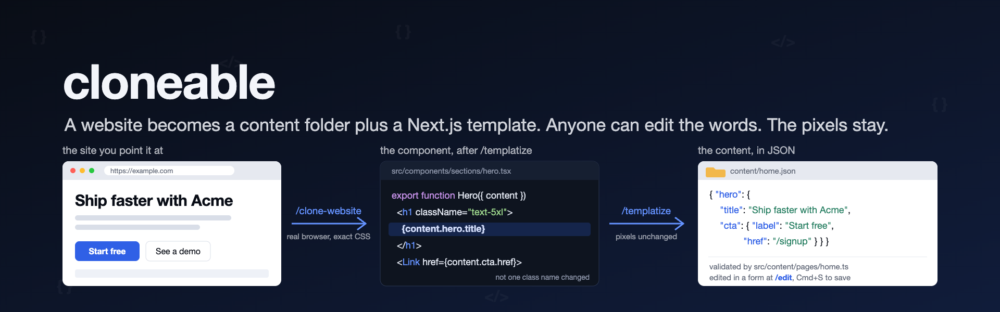
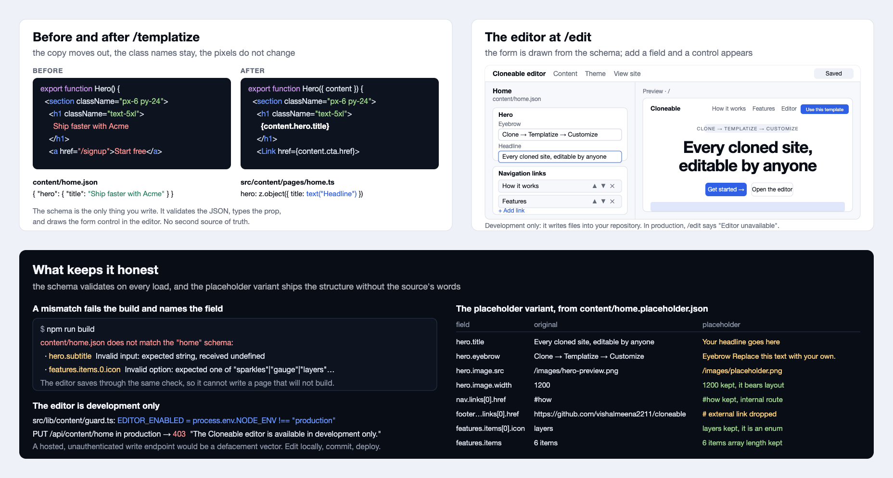
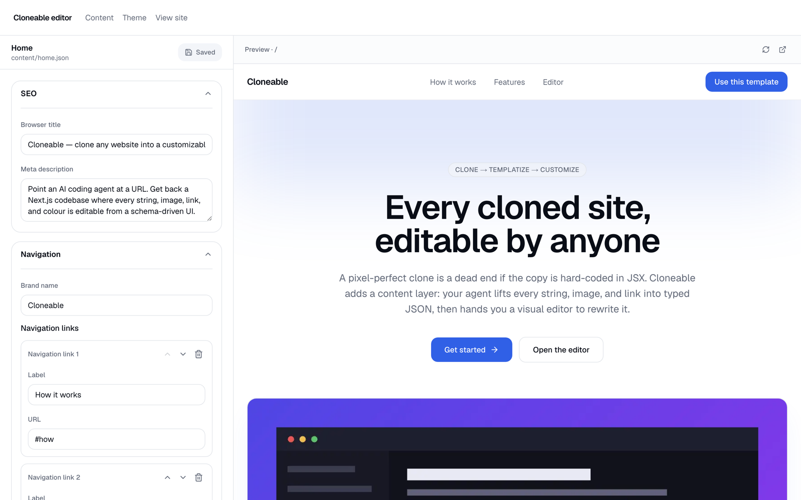
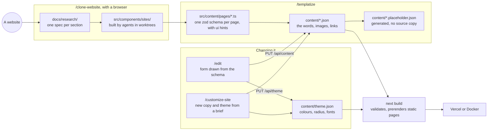

<div align="center">



<br>

**Point an AI coding agent at a website. Get back a Next.js clone whose words, pictures and links live in typed JSON,<br>with a form at `/edit` so anyone can change them without touching a component.**

<br>

[](https://nextjs.org)
[](https://react.dev)
[](https://www.typescriptlang.org)
[](https://tailwindcss.com)
[](https://zod.dev)
[](https://ui.shadcn.com)
[](https://nodejs.org)
<br>
[](#how-it-works)
[](#the-rules-it-keeps)
[](https://github.com/vishalmeena2211/cloneable/actions/workflows/ci.yml)
[](#licence)

[What it does](#what-it-does) · [The rules it keeps](#the-rules-it-keeps) · [How far to trust it](#how-far-to-trust-it) · [How it works](#how-it-works) · [Run it yourself](#run-it-on-your-machine) · [Live demo](https://cloneable.meenavishal.in)

</div>

<br>

<p align="center">
  
</p>

## Why Cloneable

Cloning a website is close to solved. Give a capable agent a browser and it will reproduce a page almost exactly.

What comes back is the problem. The copy is welded to the markup:

```tsx
<h1 className="text-5xl font-semibold tracking-tight">Ship faster with Acme</h1>
```

Every text change is now a code change. You cannot hand the site to a client, cannot reuse the layout for a second brand, and cannot let anyone who is not a developer near it. The clone is a photograph, when what you wanted was a mould.

Cloneable adds a second step. After the clone, `/templatize` splits the page in two. **Structure** stays in the component: layout, spacing, computed CSS, how it moves. **Content** moves out into JSON: words, images, links, and how many cards there are. The pixels do not change. The string now lives here:

```jsonc
// content/home.json
{ "hero": { "title": "Ship faster with Acme" } }
```

and is described here:

```ts
// src/content/pages/home.ts
hero: z.object({ title: text("Headline") })
```

That schema is the only thing you write. It validates the JSON on every load, gives the component its TypeScript type, and draws the form control in the editor. There is no second source of truth.

## What it does

| | |
|---|---|
| **Clones a page, pixel for pixel** | `/clone-website <url>` drives a real browser. It screenshots the page at 1440px and 390px, sweeps scroll, click and hover states, reads exact values with `getComputedStyle()`, writes one spec file per section, then hands each spec to a builder agent working in its own git worktree. |
| **Lifts the words out** | `/templatize` moves every string, image, link and repeated block into a zod schema plus `content/<page>.json`, rewires the components to read from it, registers the page, and generates the placeholder variant. It screenshots before and after and treats any visual difference as a bug it introduced. |
| **Rebrands from a brief** | `/customize-site "a dental clinic in Bhopal, warm and reassuring, teal palette"` rewrites the content and the theme for a new brand. It never edits a component. If the brief needs one, it reports that instead of quietly reaching in. |
| **Fails loudly, with the field path** | Content is validated on load. A mismatch between schema and JSON stops the build and names the field, such as `hero.subtitle`, instead of rendering an empty page. |
| **Edits in a form** | `/edit` draws its form from the schema. Arrays get add, remove and reorder. Enums get a dropdown. Images get a preview. The page is previewed beside the form, and Cmd+S saves. Writes pass the same validation as reads, so the editor cannot save a page that will not build. |
| **Keeps the theme in one file** | `content/theme.json` holds the colour tokens, corner radius and font stacks, and overrides the shadcn variables at runtime. The theme editor shows each token with a swatch, in light and dark. |
| **Ships without the source's words** | Every templatized page also gets `content/<page>.placeholder.json`: neutral copy and a placeholder image, with enum values, numbers, internal routes and array lengths kept, so the layout holds and the schema still passes. Set `content/config.json` to `{"variant": "placeholder"}` to serve it. |
| **Works with thirteen agents** | The three skills are written once, in `.claude/skills/`, and one script copies them for Codex CLI, Cursor, Windsurf, GitHub Copilot, Gemini CLI, OpenCode, Cline, Roo Code, Continue, Kiro, Amazon Q and Augment Code. CI fails if a copy drifts from its source. |
| **Handles more than one page** | `/clone-website` takes several URLs, keeps each source pathname as the route, and keeps every page's research, screenshots, components and assets in its own folder. |

<p align="center">
  
</p>

## The rules it keeps

- **Structure lives in components. Content lives in JSON.** Layout, spacing, computed CSS and interaction stay in the component. Words, images, links and repeat counts go in `content/`.
- **Repeats are arrays, never `card1`, `card2`.** An array gets add, remove and reorder in the editor, which is what makes a template reusable. A component must render at length zero, because someone will delete an item.
- **Variants are enums.** The editor offers a dropdown and a typo cannot reach the page.
- **No `z.any()`, no free-form record.** If the editor cannot draw a control for it, it is not content. The one exception is `theme.colors`, an open record so a clone can add tokens shadcn does not ship.
- **Props are derived, never re-declared.** A component types its prop as `Content["hero"]`, so the type cannot drift from the schema.
- **CSS never becomes content.** A `padding` field in JSON is how a template turns into a worse stylesheet.
- **Templatizing is a refactor, not a redesign.** The rendered pixels before and after must be identical, checked by screenshots at 1440px and 390px.
- **`/customize-site` never edits a component.** That is what lets the same template be rebranded again tomorrow.
- **The editor is development only.** It writes files into your repository. In a production build `/edit` shows "Editor unavailable" and the `/api/content` and `/api/theme` routes answer 403.
- **Placeholder files are generated, not hand-edited.** Regenerate them from the editor.
- **Dark mode is opt-in per theme.** `theme.json` carries `darkMode: "class" | "media" | "off"`. A clone keeps the default, `class`, so a light-only source never flips dark on a visitor whose OS is dark. The demo page uses `media` because it is this project's own page.
- **Clone only what you have the right to reproduce.** Sites you own, sites you were hired to rebuild, and learning. Not phishing, not passing another company's design off as your own, and not redistributing the source's copy, photographs, logos or marks. The placeholder variant exists so the structure can ship without them.

## How far to trust it

> [!IMPORTANT]
> **Cloneable is at version 0.1.0, released 23 August 2026.** The content layer, the editor, the theme and the placeholder generator run on this repository's own demo page, which is itself content-driven. The cloning skill is inherited from the upstream [ai-website-cloner-template](https://github.com/JCodesMore/ai-website-cloner-template) and depends on which agent you run it with and which browser tool that agent has. There are no automated tests yet: CI runs lint, the type check, the build, and a check that the generated skill copies match their sources.

Two things to know about a deployed site. **Content is read at build time.** Pages prerender as static, so changing a word on the live site means editing the JSON, committing and redeploying. That is the price of a static site with no database. **The editor does not run in production.** To let clients edit a live site you would need authentication and a content store that is not the filesystem; `src/lib/content/store.ts` is the single seam to replace, and the schemas, the form and the components stay as they are.

A live deployment of this repository runs at [cloneable.meenavishal.in](https://cloneable.meenavishal.in).

## How it works


```mermaid
flowchart LR
  URL(("A website"))
  subgraph clone ["/clone-website, with a browser"]
    SPEC["docs/research/<br/>one spec per section"]
    COMP["src/components/sites/<br/>built by agents in worktrees"]
  end
  subgraph tpl ["/templatize"]
    SCHEMA["src/content/pages/*.ts<br/>one zod schema per page, with ui hints"]
    JSON["content/*.json<br/>the words, images, links"]
    PH["content/*.placeholder.json<br/>generated, no source copy"]
  end
  subgraph edit ["Changing it"]
    EDITOR["/edit<br/>form drawn from the schema"]
    CUST["/customize-site<br/>new copy and theme from a brief"]
    THEME["content/theme.json<br/>colours, radius, fonts"]
  end
  BUILD["next build<br/>validates, prerenders static pages"]
  URL --> SPEC --> COMP --> SCHEMA
  SCHEMA --> JSON --> PH
  EDITOR -->|PUT /api/content| JSON
  EDITOR -->|PUT /api/theme| THEME
  CUST --> JSON
  CUST --> THEME
  JSON --> BUILD
  THEME --> BUILD
  BUILD --> SITE["Vercel or Docker"]
```

One schema per page, written once, does three jobs: it validates the JSON when the page loads, it types the component props, and it is turned into JSON Schema for the editor to draw its form from. `src/content/registry.ts` is the only list of pages, so it is the only place that can drift.

| Part | What it is |
|---|---|
| [`.claude/skills/clone-website`](.claude/skills/clone-website/SKILL.md) | The cloning workflow: reconnaissance, foundation, a spec file per section, builder agents, assembly, visual QA, then a hand-off to `/templatize` |
| [`.claude/skills/templatize`](.claude/skills/templatize/SKILL.md) | How literals are sorted into content or structure, the schema shape, the rewiring rules, and the parity checks |
| [`.claude/skills/customize-site`](.claude/skills/customize-site/SKILL.md) | What a rebrand may change, how to keep a palette legible in oklch, and what to report instead of editing |
| [`src/content/primitives.ts`](src/content/primitives.ts) | `text`, `longText`, `url`, `image`, `link`, `seo`: the field helpers that carry the `ui` hints the editor renders from |
| [`src/lib/content/store.ts`](src/lib/content/store.ts) | Reads `content/config.json`, picks the variant, validates the JSON, and formats the error with field paths |
| [`src/lib/content/placeholder.ts`](src/lib/content/placeholder.ts) | Walks schema and content together to strip copy and imagery while keeping structure |
| [`src/lib/theme/theme.ts`](src/lib/theme/theme.ts) | The theme schema and the CSS it renders, on `html:root` so it outranks the defaults without `!important` |
| [`src/lib/content/guard.ts`](src/lib/content/guard.ts) | `EDITOR_ENABLED`, false in production, checked by every write route and the editor layout |
| [`scripts/sync-skills.mjs`](scripts/sync-skills.mjs), [`scripts/sync-agent-rules.sh`](scripts/sync-agent-rules.sh) | Copy the skills and `AGENTS.md` into every agent's own format |

## Run it on your machine

You need Node.js 24 or newer. To clone a real site you also need an agent with a browser tool, such as Chrome MCP or Playwright MCP. Templatizing and customizing need no browser.

```bash
git clone https://github.com/vishalmeena2211/cloneable.git && cd cloneable
```

```bash
npm install
```

```bash
npm run dev
```

Then open http://localhost:3000 for the demo page and http://localhost:3000/edit to edit it. The demo page is content-driven, so the editor works before you have cloned anything.

To clone a site, start an agent with browser access, for example:

```bash
claude --chrome
```

and run the three skills in order:

```
/clone-website https://example.com
/templatize
/customize-site "a dental clinic in Bhopal, warm and reassuring, teal palette"
```

Before a pull request, run the same checks CI runs:

```bash
npm run check
```

**Deploying.** It is a standard Next.js app. [Deploy it on Vercel](https://vercel.com/new/clone?repository-url=https%3A%2F%2Fgithub.com%2Fvishalmeena2211%2Fcloneable) with no configuration: `package.json` asks for Node 24, and `next.config.ts` skips `output: "standalone"` when it sees Vercel, since that setting exists for the Dockerfile. To self-host with Docker:

```bash
docker compose up app --build
```

## Repository layout

| Folder | What is in it |
|---|---|
| [`content/`](content) | `config.json` (which variant is served), `theme.json`, and one JSON file per page plus its generated `.placeholder.json` |
| [`src/content/`](src/content) | `primitives.ts`, one zod schema per page in `pages/`, and `registry.ts`, the only list of pages |
| [`src/lib/`](src/lib) | The content loader and validator, the placeholder generator, the editor guard, and the theme renderer |
| [`src/components/`](src/components) | `sections/` take content as props; `editor/` is the schema-driven form and the theme editor; `ui/` is shadcn |
| [`src/app/`](src/app) | The routes: the demo page, `/edit`, and the development-only `/api/content` and `/api/theme` write endpoints |
| [`.claude/skills/`](.claude/skills) | The source of truth for the three skills. Every other agent folder is generated from here |
| [`docs/`](docs) | `research/` holds the inspection guide and, after a clone, the spec files; `assets/` holds the screenshots on this page |
| [`scripts/`](scripts) | The two sync scripts |

New here? Start with [`AGENTS.md`](AGENTS.md): it is the project's rules in one page, and every agent reads it.

## Roadmap

- [x] Content layer: zod schemas, JSON per page, validation on load with field paths
- [x] Schema-driven editor at `/edit`, with live preview and Cmd+S
- [x] Theme layer in `content/theme.json`, with `class`, `media` or `off` dark mode
- [x] Placeholder variant generator, schema-aware
- [x] `/templatize` and `/customize-site`, with `/clone-website` handing off to them
- [x] One skill source synced to thirteen agents, checked in CI
- [x] Deployed on Vercel at cloneable.meenavishal.in
- [ ] Hosted editor: authentication plus a database-backed content store behind the same schemas
- [ ] CMS adapters for the loader seam, such as Sanity and Payload
- [ ] Whole-site crawl with shared-layout detection
- [ ] Block library extraction: clone several sites into a reusable section library
- [ ] Automated tests

## Contributing

**If you clone sites:** the most useful thing you can do is run the three skills on a real page and open an issue with what the clone got wrong, what `/templatize` put in the wrong bucket, or what `/customize-site` asked for that it should not have.

**If you write code:** read [`AGENTS.md`](AGENTS.md) and [`CONTRIBUTING.md`](CONTRIBUTING.md) first. Run `npm run check` before opening a pull request. If you touch `AGENTS.md` or any `.claude/skills/*/SKILL.md`, run `bash scripts/sync-agent-rules.sh` and `node scripts/sync-skills.mjs` and commit the generated files; CI checks that they match. Do not templatize several pages at once in one worktree: they all edit `src/content/registry.ts`.

Security reports go through GitHub's private [report a vulnerability](https://github.com/vishalmeena2211/cloneable/security/advisories/new) form, as [`SECURITY.md`](SECURITY.md) describes.

## Credits

Cloneable is a fork. The cloning skill, the agent sync scripts and the Next.js scaffold come from [ai-website-cloner-template](https://github.com/JCodesMore/ai-website-cloner-template) by JCodesMore. The content layer, the editor, the theme, the placeholder generator and the `/templatize` and `/customize-site` skills were added here.

It is built on [Next.js](https://nextjs.org), [React](https://react.dev), [Tailwind CSS](https://tailwindcss.com), [shadcn/ui](https://ui.shadcn.com) with [Base UI](https://base-ui.com), [zod](https://zod.dev), [Lucide](https://lucide.dev) icons, and the [Geist](https://vercel.com/font) fonts.

## Licence

**[MIT](LICENSE).** The licence file carries two copyright lines: JCodesMore for the upstream template, and the Cloneable contributors for this fork. Use it, change it and share it, keeping both notices.

Anything you clone with it keeps its owner's rights. The licence covers this code, not the sites it reproduces.

## Words used here

| Word | What it means |
|---|---|
| **Clone** | A Next.js rebuild of a page that matches the original's pixels, with the copy still inside the components |
| **Templatize** | The refactor that moves the copy out of the components into JSON, without changing a pixel |
| **Content layer** | The schemas in `src/content/pages/`, the JSON in `content/`, and the loader that validates one against the other |
| **Schema** | The zod description of one page's content. It validates the JSON, types the props and draws the form |
| **Variant** | Which JSON a page serves: `original`, the source's words, or `placeholder`, neutral stand-ins. Set in `content/config.json` |
| **Skill** | A workflow an agent follows when you type its name, such as `/templatize`. Written once in `.claude/skills/`, copied for other agents |
| **Spec file** | What `/clone-website` writes for each section before a builder touches it: exact CSS, states, assets, and the text verbatim |
| **Worktree** | A second checkout of the repository on its own branch, so builder agents can work in parallel without overwriting each other |

<br>

<div align="center">
<sub>Clone the structure, not the words. The clone is the starting point, not the deliverable.</sub>
</div>
